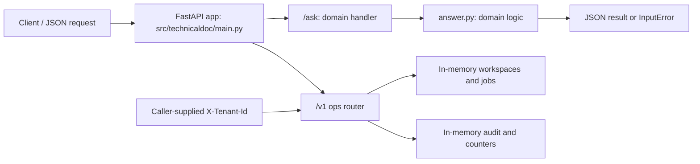

# Technical Documentation Rag Assistant: project architecture

This diagram describes the implemented local service. The domain path is deterministic Python logic; it does not call a hosted model or execute production changes.

The handler translates `InputError` to HTTP 422. Domain logic is implemented in [answer.py](src/technicaldoc/answer.py); router registration is in [main.py](src/technicaldoc/main.py). Ops state and policy checks are in [ops.py](src/technicaldoc/ops.py). The tenant header is a lab selector, not authenticated identity. Global dictionaries are process-local and reset on restart. Ops jobs are records; no worker executes them or invokes the domain endpoint.

## Repository components

| Path | Responsibility |
| --- | --- |
| [src/technicaldoc/answer.py](src/technicaldoc/answer.py) | Domain behavior and validation |
| [src/technicaldoc/main.py](src/technicaldoc/main.py) | HTTP routes and domain error translation |
| [src/technicaldoc/ops.py](src/technicaldoc/ops.py) | Workspace/job records, tenant filtering, audit, counters |
| [tests](tests/) | Domain examples and ops behavior checks |
| [Dockerfile](Dockerfile) | Python runtime and Uvicorn entry point |
| [k8s](k8s/) | Local Kubernetes deployment examples |

## Deployment boundary

The Dockerfile serves `technicaldoc.main:app` on port 8080. Container packaging does not add storage durability, authentication, or job execution. Multiple workers hold separate ops state. Kubernetes manifests are lab examples, not evidence that a customer environment is deployed.

## Request and job flows

See [process diagrams](docs/PROCESS_FLOW.md) for the domain request and the independent approval state flow. See [interview questions and answers](INTERVIEW_QA.md) for concrete behavior, tradeoffs, and limitations.
