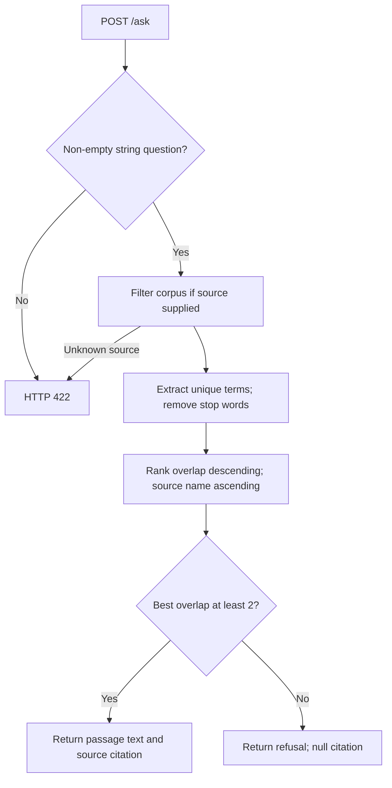
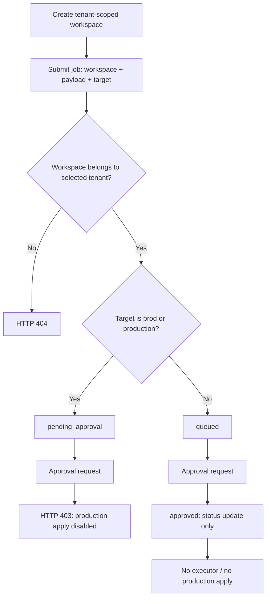

# Technical Documentation Rag Assistant: process flows

## Domain request

Endpoint: `POST /ask`. Input: question + optional source. The processing stages below summarize [answer.py](../src/technicaldoc/answer.py); they are local function behavior, not externally executed tools.

Refusal responses, where implemented, are normal domain results rather than successful execution of a requested write. Detailed edge cases are covered in [INTERVIEW_QA.md](../INTERVIEW_QA.md).

## Workspace and job approval

Approval first checks job ownership using the selected tenant. Status changes and audit records remain in memory. The approval endpoint does not enforce a full transition state machine: repeated lab approval is possible. The domain request flow and this job-record flow are independent. Source: [ops.py](../src/technicaldoc/ops.py).
